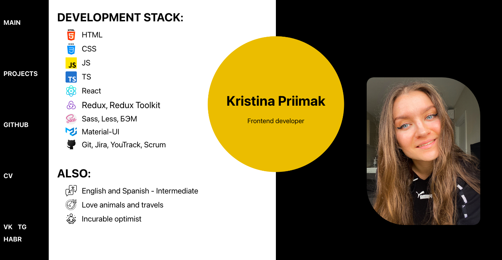

<h1 align="center">Hi, I'm Kristina Priimak.</h1>
<a href="https://krisprymak.github.io/portfolio_react/#/">Portfolio</a>

 <!-- html: "https://cdn-icons-png.flaticon.com/512/5968/5968267.png",
    css: "https://cdn-icons-png.flaticon.com/512/888/888847.png",
    scss: "https://cdn-icons-png.flaticon.com/512/919/919831.png",
    react: "https://cdn-icons-png.flaticon.com/512/1126/1126012.png",
    redux:
      "https://d33wubrfki0l68.cloudfront.net/0834d0215db51e91525a25acf97433051f280f2f/c30f5/img/redux.svg",
    rt: "",
    mui: "https://seeklogo.com/images/M/material-ui-logo-5BDCB9BA8F-seeklogo.com.png",
    jest: "",
    js: "https://cdn-icons-png.flaticon.com/512/5968/5968292.png",
    ts: "https://cdn-icons-png.flaticon.com/512/5968/5968381.png", -->
<!-- <ul>
<h2>My stack:</h2>

</ul> -->

<h2>Projects</h2>
Check my projects on web portfolio   https://krisprymak.github.io/portfolio_react/#/projects

<ul> 
<h2>Books that helped to learn:</h2>
<li>JavaScript for Kids. Nick Morgan</li>
<li>CSS3: The Missing Manual. David Sawyer McFarland</li>
<li>Object-Oriented Thought Process. Matt Weisfeld </li>
<li>You Don't Know JS. Kyle Simpson</li>
</ul> 
